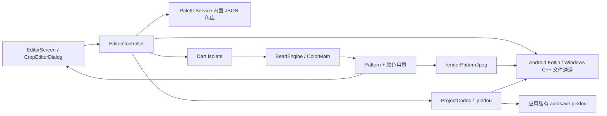

# 拼豆工坊当前程序实现核对说明

本文描述当前代码实际实现，而不是目标设计。用途是帮助开发者、测试人员和产品负责人核对：程序现在如何工作、哪些行为属于明确设计、哪些地方可能存在风险或需要进一步确认。

## 1. 文档基线

| 项目 | 当前值 |
| --- | --- |
| 文档核对日期 | 2026-08-09 |
| 本地分支 | `main` |
| 文档对应代码 | `v1.2.2` 发布候选 |
| 上一发布基线 | `v1.2.1`，指向 `511147c` |
| 本次目标标签 | `v1.2.2` |
| Dart 包名 | `pindou_studio` |
| Android applicationId | `top.mossmoss.pindoustudio` |
| Android 原生通道 | `top.mossmoss.pindoustudio/files` |
| Windows 可执行文件 | `PindouStudio.exe` |
| 源码版本号 | `1.2.2+5` |
| CI 固定 Flutter 版本 | `3.44.9 stable` |
| Dart SDK 约束 | `^3.12.2` |

本文描述的功能对应 `1.2.2+5` 发布候选。它基于 `v1.2.1`，在保留双指缩放的同时增加预览区悬浮加减按钮、中心平滑缩放和实时倍率反馈。

## 2. 产品当前能力边界

当前应用是一个单页面、纯本地图像处理工具，支持 Android 和 Windows：

- 导入图片并读取 EXIF 方向。
- 自由裁剪或按原图、1:1、4:3、3:4 比例裁剪。
- 以 90° 为单位左转或右转。
- 将图片转换成 8–200 颗宽、8–200 颗高的拼豆图。
- 使用 Perler、Hama、Artkal 三套内置色库。
- 限制最大颜色数，可选 Floyd–Steinberg 误差扩散抖动。
- 显示拼豆预览、颜色编号和用量统计。
- 可开关预览色号图层；导出的 JPG 与色号开关联动。
- 可逐格多选、选择全部同色，并从当前品牌色盘替换色号。
- 导出带网格或不带网格、带色号或不带色号的 JPG。
- 保存/打开 `.pindou` 工程文件，并在启动时自动恢复上次编辑。
- 跟随系统浅色/深色主题。
- 针对手机、普通桌面和短宽横屏平板使用不同布局。

当前明确不包含：

- 登录、云同步、网络请求或用户账号。
- 历史记录、撤销/重做、最近工程列表或云端工程同步。
- 自定义色库导入和色库编辑。
- PNG、PDF、SVG 等成品图导出格式。
- Windows 安装包、自动更新和 Windows 可执行文件代码签名。
- iOS、macOS、Linux 或 Web 适配。

## 3. 总体架构

程序采用 Flutter UI + Riverpod 状态管理 + Dart Isolate 图像计算 + 平台原生文件通道的结构。

主要目录职责如下：

| 目录或文件 | 实际职责 |
| --- | --- |
| `lib/main.dart` | 初始化 Flutter，创建顶层 `ProviderScope`。 |
| `lib/app.dart` | 创建 `MaterialApp`，配置主题和首页。 |
| `lib/features/editor/editor_screen.dart` | 主界面、响应式布局、预览和用量统计。 |
| `lib/features/editor/editor_controller.dart` | 业务流程、状态变更、平台通道调用、Isolate 调度。 |
| `lib/features/editor/editor_state.dart` | 编辑器不可变状态模型。 |
| `lib/features/editor/crop_editor_dialog.dart` | 裁剪、比例限制、旋转交互。 |
| `lib/features/editor/pattern_painter.dart` | 屏幕上的拼豆网格绘制。 |
| `lib/engine/bead_engine.dart` | 解码、裁剪、缩放、选色、抖动和 JPG 渲染。 |
| `lib/engine/color_math.dart` | sRGB 到 CIELAB 转换及 LAB 欧氏距离。 |
| `lib/services/palette_service.dart` | 从 Flutter assets 加载三套 JSON 色库。 |
| `lib/services/project_codec.dart` | 版本化 `.pindou` 工程编码、校验和恢复。 |
| `android/.../MainActivity.kt` | Android 图库选择、JPG/工程文件打开保存及应用数据路径。 |
| `windows/runner/flutter_window.cpp` | Windows 图片、JPG 和工程文件打开/保存对话框。 |
| `.github/workflows/release.yml` | Android、Windows 构建和 GitHub Release 发布。 |

项目没有使用数据库、Repository 层、路由系统或依赖注入容器。当前工程持久化是单文件快照，不包含项目索引或历史数据库；如果以后加入工程列表、版本历史或更多页面，需要重新划分业务层和存储层。

## 4. 状态管理实现

`editorProvider` 是 `StateNotifierProvider<EditorController, EditorState>`。应用启动时创建一个 `EditorController` 并立即调用 `initialize()`。

`EditorState` 当前保存：

- 三套色库及当前品牌。
- 原图全部字节、文件名、宽度和高度。
- 归一化裁剪区域和旋转次数。
- 拼豆宽高、比例锁定、最大颜色数、抖动、网格和色号图层开关。
- 当前生成的 `Pattern`。
- 色号编辑模式及当前选中的色块索引。
- 色库加载、图案生成、JPG 导出状态。
- 最近错误、操作通知和最近导出位置。

可编辑状态仍由内存中的 `EditorState` 驱动，但有效编辑改变后会以 600 毫秒防抖写入 `autosave.pindou`。Windows 存放于 `%APPDATA%\PindouStudio`，Android 存放于应用私有 `files/pindou-studio`。工程 JSON/Base64 编解码在后台 Isolate 中运行；连续修改时通过状态修订号丢弃过期快照，避免旧保存覆盖新状态。启动加载色库后自动读取快照；损坏或不兼容的文件不会覆盖初始状态，并显示恢复错误。

大多数生成参数改变时会设置 `clearPattern: true`，避免旧图案与新参数不一致；网格、色号图层和手工替色只改变现有图案或显示状态，不会重新运行图片匹配。

手动工程文件与自动快照使用同一版本化 JSON 格式，当前格式版本为 1。文件内嵌原图 Base64、裁剪/生成参数、颜色矩阵、手工替色结果、显示开关和选区。解码会检查格式标识、版本、尺寸、裁剪范围、颜色索引和色块数量；工程内保存的颜色定义用于保持编辑结果，不依赖未来色库资源是否改变。

实现依赖两个隐含条件：

1. `selectedBrand` 默认是 `Perler`。
2. `initialize()` 使用“第一套色库”的颜色数初始化最大颜色数，而资源列表第一项刚好是 Perler。

如果以后调整色库资源顺序但不调整默认品牌，这两个值可能不再对应。

## 5. 图片导入流程

### 5.1 Android

Android 使用手写 Kotlin MethodChannel，不依赖 Flutter 文件选择插件。

- Android 13 及以上：启动 `MediaStore.ACTION_PICK_IMAGES`，使用系统 Photo Picker。
- Android 12 及以下：启动 `Intent.ACTION_PICK` 和 `MediaStore.Images.Media.EXTERNAL_CONTENT_URI`，优先进入系统图库。
- 设备没有图库处理器时：捕获 `ActivityNotFoundException`，回退到 `ACTION_OPEN_DOCUMENT`。
- 用户选中图片后：原生侧通过 `ContentResolver.openInputStream()` 一次性读取全部字节，并通过 MethodChannel 返回字节和显示名称。
- 不申请 `READ_MEDIA_IMAGES` 或旧版存储权限，因为读取权限由系统选择器临时授予。

Android 29 平板模拟器已经验证实际进入 `com.android.gallery3d/.app.GalleryActivity`，并成功读取 `bootlogo.png`。

### 5.2 Windows

Windows Runner 通过 Win32 `GetOpenFileNameW` 打开原生文件对话框：

- 默认过滤 JPG、JPEG、PNG，但仍提供“All files”，所以用户仍可能选择无法解码的文件。
- 对话框运行在 detached `std::thread`，避免阻塞 Flutter UI 线程。
- 对话框结果通过私有消息 `WM_APP + 0x421` 投递回 Runner 窗口线程，再完成 MethodChannel 回调。
- 使用 UTF-16/UTF-8 转换支持中文路径。
- `file_dialog_open_` 防止同时打开多个文件对话框。

这里保留了针对历史 Windows 崩溃的实现约束：Flutter 主界面切换空状态、就绪状态和图案状态时不使用 `AnimatedSwitcher`，避免 Flutter 3.44 Windows AccessibilityBridge 在语义节点重挂载期间崩溃。详见 `windows_image_load_crash_analysis.md`。

### 5.3 Dart 侧解码

原图字节保存在 `EditorState.sourceBytes`。首次导入会在 `Isolate.run()` 中：

1. 使用 `image` 包解码。
2. 使用 `bakeOrientation()` 应用 EXIF 方向。
3. 返回矫正后的宽高。
4. 默认设置宽度为 40 颗，并按原图比例计算高度。
5. 重置裁剪和已有图案。

## 6. 裁剪与旋转实现

`CropSpec` 使用 0–1 的归一化坐标保存：

- `left`、`top`：裁剪框左上角。
- `width`、`height`：裁剪框相对宽高。
- `quarterTurns`：90° 旋转次数。

裁剪编辑器特点：

- 对话框最大 900×740 logical pixels。
- 自由比例可拖动四个角，也可拖动裁剪框整体。
- 固定比例支持原图、1:1、4:3、3:4。
- 裁剪框拖动最小尺寸约为画布的 6%；应用预设比例时最小约为 8%。
- 没有边中点手柄、数值输入、键盘微调或撤销功能。
- 旋转时会重建为只有 `quarterTurns` 的新 `CropSpec`，也就是旋转会把此前裁剪范围重置为全图。这是当前实际行为，需要确认是否符合预期。

生成阶段先旋转图片，再对旋转后的图片应用归一化裁剪坐标，因此裁剪编辑器和生成引擎的坐标顺序是一致的。

## 7. 拼豆生成算法

生成工作在 `Isolate.run()` 中，不阻塞 Flutter UI Isolate。

实际步骤如下：

1. 解码原图并应用 EXIF 方向。
2. 按 `quarterTurns` 旋转。
3. 把归一化裁剪区域换算成整数像素并裁剪。
4. 使用 `Interpolation.average` 强制缩放到目标拼豆宽高。
5. 透明像素与纯白色背景合成，后续不保留透明通道。
6. 把色库全部颜色从 sRGB 转换到 CIELAB。
7. 每个像素先匹配完整色库，统计每个色号的粗略使用次数。
8. 按粗略次数排序，只保留前 `maximumColors` 个颜色。
9. 每个像素再次在保留色集合中匹配；可选 Floyd–Steinberg 抖动。
10. 生成 `Pattern`，保存每个格子的颜色索引、最终颜色列表和计数。

### 7.1 色差算法

当前使用 LAB 三个分量的平方欧氏距离，等价于比较 CIE76 距离但省略平方根。没有使用 CIEDE2000，也没有针对拼豆材料、环境光或显示器做色彩校准。

### 7.2 最大颜色数的含义

“最大颜色数”不是全局最优颜色量化。当前算法先按完整色库的最近色出现次数选出前 K 个色号，再把所有像素重映射到这 K 个色号。

它速度快、行为稳定，但存在以下可能：

- 某个粗略次数较少、但对降低整体误差很重要的颜色可能被排除。
- 开启抖动时，候选颜色集合仍由“未抖动的粗匹配”决定。
- 结果不等价于 K-means、Median Cut 或最小化总 LAB 误差的组合搜索。

如果产品要求“限制颜色数时尽可能接近原图”，这一部分应作为重点算法核对项。

### 7.3 抖动

抖动使用标准 Floyd–Steinberg 权重：右侧 7/16，左下 3/16，下方 5/16，右下 1/16。

当前始终从左向右扫描，不使用蛇形扫描。误差以三份 `double` 数组保存，目标上限 200×200 时内存量可控。

## 8. 预览与导出

### 8.1 屏幕预览

`PatternPainter` 逐格绘制颜色：

- 单格足够大时绘制一个半透明高光点，模拟拼豆质感。
- 开启网格且单格尺寸至少 2.5 logical pixels 时才绘制网格，避免缩小后网格过密。
- `InteractiveViewer` 支持 0.75–12 倍缩放，边界留白 80 logical pixels。
- 预览左下角提供悬浮“＋ / 当前倍率 / －”控件，每次以预览中心为焦点平滑缩放 1.25 倍；按钮动画期间开始双指操作会立即停止动画，避免控制冲突。
- 色号图层开启时，根据当前缩放比例判断色号是否达到可读尺寸；缩放到可读尺寸后按明暗自动使用黑字或白字。
- 色号编辑模式下，点击色块逐个切换选中状态，也可以扩展为全部同色。
- 色号选择页根据弹窗可用宽高计算 N 行 × M 列，28–32 个品牌色以正方形全色表同时展示，不需要滚动；色号叠加在色块上，名称通过悬停提示查看。
- 当前选区涉及的一个或多个原色都会以主题色双层边框、阴影和勾选标记同时突出；点击任一目标色后立即替换并关闭弹窗。
- 选中格使用主题主色的半透明填充和描边，替色后会压缩未使用颜色并重算颜色用量。

### 8.2 JPG 导出

`renderPatternJpeg()` 在后台 Isolate 中生成 JPG：

- 不显示色号时最长边目标约为 3600 像素，单格像素尺寸限制在 4–48 之间。
- 显示色号时，单格会至少扩大到可容纳最长色号的 18–30 像素；最大 200 颗、四字符色号通常输出约 3600 像素长边。
- JPG 质量为 94。
- 开启网格时绘制格线和外边框。
- 开启色号时使用内置 3×5 紧凑像素字形绘制数字和英文字母，不依赖系统字体；文字颜色按底色亮度自动选择黑/白。
- 导出图包含颜色块、可选网格和可选色号，不包含颜色用量表、品牌、色号图例或标题。

文件名基于原图名称生成：`原文件名_拼豆图.jpg`，并替换 Windows 非法文件名字符。

### 8.3 平台保存

- Android：使用 `ACTION_CREATE_DOCUMENT`，由用户选择保存位置；成功返回的是 `content://` URI，成功提示目前会直接展示这个 URI，而不是友好的文件路径。
- Windows：使用 `GetSaveFileNameW`；Dart 获得文件路径后写入全部 JPG 字节。

### 8.4 工程文件

- 工具栏工程菜单可打开或保存 `.pindou` 文件。
- Android 通过 `ACTION_OPEN_DOCUMENT` / `ACTION_CREATE_DOCUMENT` 读取或保存工程字节。
- Windows 使用带 `.pindou` 过滤器的异步原生文件对话框，Dart 负责文件读写。
- 工程文件内嵌原图，因此不会依赖原图片路径，但文件大小通常略大于原图。
- 当前没有工程压缩、增量保存、最近文件列表、自动快照轮换或撤销历史。

## 9. 色库实现

色库是随应用打包的 JSON assets：

| 品牌 | 文件 | 当前颜色数 |
| --- | --- | ---: |
| Perler | `assets/palettes/perler.json` | 28 |
| Hama | `assets/palettes/hama.json` | 28 |
| Artkal | `assets/palettes/artkal.json` | 32 |

每个颜色只包含品牌色号、名称和 RGB。加载时没有执行以下校验：

- 色号是否重复。
- RGB 是否超出 0–255。
- 品牌是否重复。
- 文件是否覆盖品牌的完整官方色表。

应用也没有色库版本号。色库内容发生变化后，同一张图片和同一组参数可能生成不同结果。

## 10. 响应式界面

主界面根据 `LayoutBuilder` 的 logical pixel 约束选择布局：

| 条件 | 布局 |
| --- | --- |
| 宽度 `< 920` | 手机单列滚动布局，预览固定高 470。 |
| 宽度 `>= 920` 且内容高度 `>= 720` | 宽屏布局，左侧参数栏固定宽 374，用量统计位于预览下方，高 220。 |
| 宽度 `920–1049` 且内容高度 `< 720` | 紧凑宽屏布局，左栏宽 350，用量统计位于下方，高 156。 |
| 宽度 `>= 1050` 且内容高度 `< 720` | 三栏布局：左侧参数、中间预览、右侧用量统计。 |

三栏布局中：

- 左侧参数栏和右侧用量栏可以独立隐藏。
- 两个恢复按钮始终保留在预览标题栏。
- 两侧都隐藏后，预览占用几乎全部内容宽度。
- 显隐状态只保存在 `_DesktopEditorState` 内存中，不会跨应用重启保存；切换到手机布局导致组件销毁后也会重置。

1920×1080、280 dpi、约 7.9 英寸的横屏模拟器已经完成三栏、单侧隐藏、双侧隐藏和恢复测试。

需要继续核对的界面边界：

- 极窄手机上同时显示长标题和导出按钮时的 AppBar 空间。
- 大字体/无障碍字体缩放下的卡片和标题栏溢出。
- 手机横屏高度很小时，固定 470 高的预览是否合适。
- 键盘操作、屏幕阅读器语义和颜色对比度。

## 11. 性能和内存特征

耗时的图片解码、拼豆生成、JPG 编码以及工程 JSON/Base64 编解码已经放入 Isolate，主界面通常不会因 CPU 计算完全卡住。

但当前仍采用“整文件、整图、整数组”策略：

- Android 原生侧先把整张图片读入 `ByteArray`。
- MethodChannel 再把整份字节复制到 Dart。
- `EditorState` 长期保存原图字节。
- 解码和生成 Isolate 会再次传递数据并创建完整解码图。
- 生成时还会为每个目标像素保存 RGB double 数组；抖动模式再增加三份误差数组。

目标拼豆图最多 200×200，因此生成数组本身不大。真正风险来自超高分辨率原图：大文件、解码后的 RGBA 图和跨 Isolate/MethodChannel 复制可能形成较高瞬时内存峰值。当前没有文件大小、像素尺寸或解码内存上限。

## 12. Android 构建与签名

当前 Gradle 配置：

- namespace/applicationId：`top.mossmoss.pindoustudio`。
- Java/Kotlin target：17。
- `minSdk`、`targetSdk`、`compileSdk` 继承 Flutter 配置。
- 已发布 v1.1.0 APK 实际为 minSdk 24、targetSdk 36、compileSdk 36。
- Kotlin 增量编译关闭并使用 in-process 编译，原因是 Pub Cache 在 C 盘、项目在 D 盘，避免跨盘相对路径异常。
- Gradle Wrapper：9.1.0。

Release 构建必须读取 `android/key.properties`。没有正式签名配置时 Release 构建失败，不再回退到 Debug 证书。

本地正式 keystore 约定位置为 `E:\Android\libb.keystore`；密码和 `android/key.properties` 不进入 Git。

## 13. Windows 构建

- 默认窗口标题：`拼豆工坊 - Pindou Studio`。
- 标题使用 Unicode 转义字面量，避免 MSVC 按本机源代码页编译 UTF-8 中文后出现乱码。
- 默认窗口大小：1280×720。
- 输出程序名：`PindouStudio.exe`。
- 使用 C++17、Unicode 和 `/W4 /WX`。
- 发布物是包含 EXE、Flutter DLL、`data` 和 assets 的便携 ZIP。

Windows 资源文件仍有旧信息：

- `CompanyName` 是 `com.pindou`。
- 版权信息是 `Copyright (C) 2026 com.pindou`。

这与正式 Android 域名 `top.mossmoss.pindoustudio` 及当前产品归属不一致，建议确认后修改。

## 14. GitHub Actions 发布流程

`.github/workflows/release.yml` 支持：

- 推送 `v*` 标签：构建 Android 和 Windows，并创建 GitHub Release。
- 手动触发：构建并上传 Artifacts，不创建 Release。

Android 流程：

1. Checkout。
2. 安装固定版本 Flutter。
3. `flutter pub get`。
4. 从四个 GitHub Secrets 恢复 keystore 和 `key.properties`。
5. `flutter build apk --release`。
6. 重命名并上传 APK。

Windows 流程：

1. Checkout。
2. 安装固定版本 Flutter。
3. `flutter pub get`。
4. `flutter build windows --release`。
5. 压缩整个 Release 目录并上传 ZIP。

两个构建都成功后，Release job 下载两个 Artifact，并发布 GitHub Release。

当前 CI 缺少三项重要校验：

1. 没有运行 `flutter analyze` 和 `flutter test`，所以“能构建”不等于“测试通过”。
2. 没有校验标签 `vX.Y.Z` 是否与 `pubspec.yaml` 的版本名一致。
3. 没有固定并核对 Android 正式证书 SHA-256；有效但错误的 keystore 仍可能构建成功，导致新 APK 无法覆盖安装旧版本。

此外，Android 只发布通用 APK，没有 AAB 或按 ABI 拆分；Windows 没有安装包和代码签名。

## 15. 自动化测试现状

当前共有 10 项测试：

### 引擎测试 4 项

- 生成结果受最大颜色数限制，并且统计总数等于拼豆总数。
- 抖动、旋转后可以生成可解码的 JPG，并分别覆盖色号图层关闭和开启。
- 多格替色后会移除未使用颜色并正确重算索引和数量。
- LAB 中近似白色比黑色更接近白色。

### 工程编码与持久化测试 3 项

- 原图、裁剪、参数、显示图层、颜色矩阵、手工替色结果和选区可以完整往返恢复。
- 非拼豆工坊工程文件会被拒绝。
- 控制器可把一次真实编辑写入临时 `autosave.pindou`，新控制器启动后能恢复原图信息与图层开关。

### Widget 测试 3 项

- 1280×800 下主导入流程组件能够渲染。
- 1920×1080、1.75 DPR 下进入三栏模式，左右栏能隐藏，且隐藏后预览宽度增加。
- 色号图层可以关闭，编辑模式可以选中多个不同原色，在 32 色桌面表格中同时标注，缩到 500 像素宽时自动减少列数并保持全部颜色可见，选择目标色后完成替换；悬浮缩放按钮可将倍率从 100% 放大到 125% 并恢复到 100%。

当前没有覆盖：

- 裁剪坐标、固定比例和旋转重置行为。
- 透明图片、损坏图片、超大图片和非常规格式。
- 颜色限制算法的精确输出和无抖动/抖动差异。
- 无网格 JPG、极限尺寸色号图、文件名清理、导出取消和导出异常。
- 自动保存防抖、应用退出时最后一次写入及真实正式应用数据目录的自动化测试。
- Android Photo Picker、旧版图库回退、工程/JPG 文档流程的自动化测试。
- Windows 文件对话框、工程读写、中文路径和窗口关闭竞态的自动化测试。
- 手机断点、紧凑底栏断点、深色主题和大字体。
- Windows AccessibilityBridge 历史崩溃的自动回归测试。

## 16. 建议优先核对的问题

### 高优先级

1. **发布版本一致性**：本次目标标签 `v1.2.2` 必须与 `pubspec.yaml` 的 `1.2.2+5` 版本名一致，并保持 Android build number 递增。
2. **发布 CI 质量门禁**：是否应在构建前强制运行 analyze/test，并校验标签与二进制版本一致。
3. **正式签名连续性**：是否在 CI 固定预期证书 SHA-256，避免 Secrets 被替换后发布不可升级的 APK。
4. **超大图片内存**：是否限制文件大小/像素数，或改为原生路径传递和分阶段缩放，避免 Android 低内存设备 OOM。

### 中优先级

1. **颜色数限制算法**：当前“出现次数前 K”是否满足产品对色差质量的要求。
2. **旋转行为**：旋转会清除当前裁剪框，是否应改成保留或转换裁剪区域。
3. **格式口径**：系统图库允许选择 `image/*`，但 UI 宣称 JPG/PNG；WebP 通常可解码，HEIC 等格式可能失败。需要统一允许范围和提示。
4. **工程文件体积**：当前内嵌原图并使用 Base64 JSON，是否需要 ZIP 压缩、缩略图或外部原图引用。
5. **撤销/重做**：手工替色会立即覆盖当前 `Pattern`，是否需要编辑历史。
6. **导出内容**：是否需要把数量、品牌和图例一起导出，而不只是网格与格内色号。
7. **测试覆盖**：当前测试已覆盖新增核心状态，但平台原生对话框和错误路径仍较少。

### 低优先级

1. Windows EXE 的 CompanyName 和版权字段仍为旧值。
2. Android 导出成功提示显示 `content://` URI，不够友好。
3. 三栏显隐状态和缩放状态不持久化；工程只保存编辑状态和色块选区。
4. `cupertino_icons` 依赖当前代码未见使用，可确认后移除。
5. Windows 仅提供便携 ZIP，没有安装、卸载和代码签名体验。

## 17. 建议核对清单

- [ ] 确认最大颜色数的启发式算法是否符合期望。
- [ ] 确认透明区域按白色处理是否正确。
- [ ] 确认关闭比例锁定后允许图片被强制拉伸是否正确。
- [ ] 确认旋转时重置裁剪区域是否正确。
- [ ] 确认图库允许的图片格式和 UI 文案是否一致。
- [ ] 确认导出是否还需要包含品牌图例和用量表。
- [ ] 确认工程是否需要压缩、最近文件列表及撤销/重做历史。
- [ ] 确认 Android 超大图片的文件/像素限制。
- [ ] 确认 Windows 公司名、版权和代码签名信息。
- [ ] 在 CI 增加 analyze/test、标签版本和正式证书指纹校验。
- [x] 悬浮缩放按钮发布前提升到 `1.2.2+5`。

## 18. 已完成的人工验证

- Windows 版本成功启动，历史图片加载崩溃已修复并形成专项报告。
- Android 手机模拟器完成基本启动和导入测试。
- Android 1920×1080 横屏平板完成导入、生成、裁剪、三栏布局、两侧隐藏和恢复测试。
- Android 29 模拟器完成 Gallery 选择 `bootlogo.png` 并读取尺寸测试。
- 本次 Windows Debug 版成功启动，新版布局和工程菜单显示正常，原生图片文件对话框能够打开；受界面控制服务无法切换到系统模态窗口限制，未在本轮重新完成文件选择。
- `flutter analyze` 当前通过。
- 当前 10 项自动化测试全部通过。
- Android Debug APK 和 Windows Debug 程序均完成真实原生编译。
- v1.1.0 GitHub Actions 的 Android、Windows、Release jobs 已成功完成。
- 线上 v1.1.0 APK 已核对 applicationId、版本、正式签名和 SHA-256；Windows ZIP 已核对包含 `PindouStudio.exe`。

人工验证不替代自动化回归；悬浮加减按钮和中心平滑缩放以 `v1.2.2` 为首次目标发布版本，发布流程必须重新完成 Android、Windows 和 Release 三个 job。
